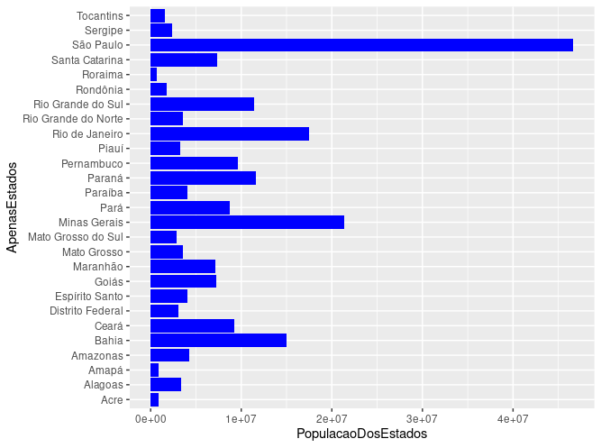
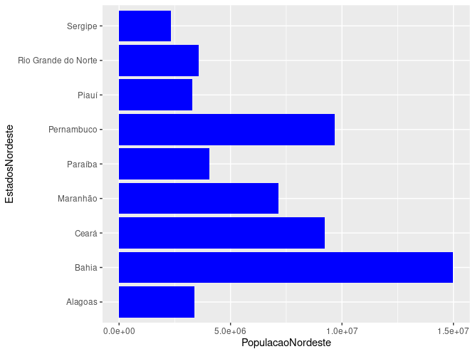
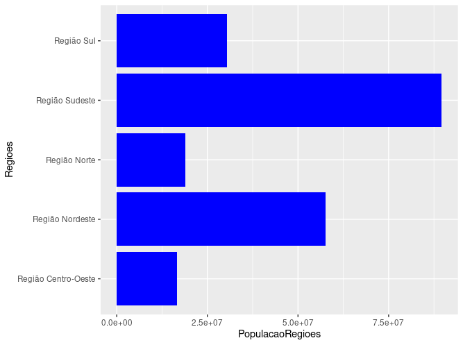
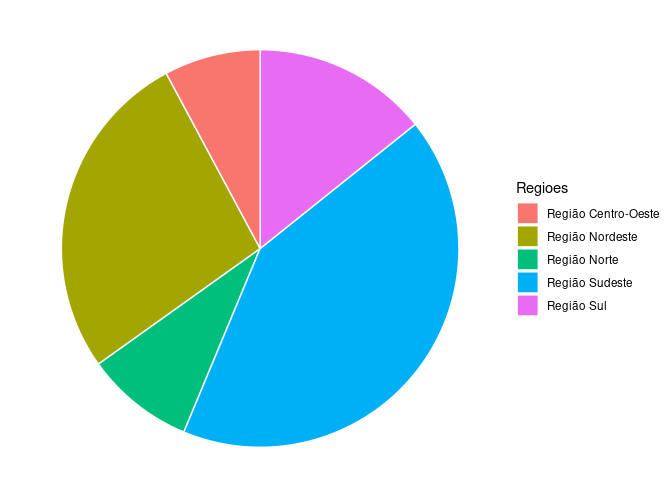

# População Estados em R

Analise de um dado em planilha .xlsx e criação de gráficos em barras e calculo de taxa de variancia dos dados informados

## 🚀 Começando

Fazer upload do arquivo no RStudio para poder executa-lo e realizar o upload da tabela de dados

### 📋 Pré-requisitos

Um nevegador web e acesso a internet para acessar o RStudio Cloud

## 🎯 Demonstrações

## 🖇️ Colaborando

Por favor, se deseja coloborar enviar e-mail para bruno.gdscosta@gmail.com

## ✒️ Autores

Mencione todos aqueles que ajudaram a levantar o projeto desde o seu início

* **Bruno Gabriel dos Santos Costa** - *Todo o trabalho* - [Bruno Gabriel](https://github.com/Bruno-Gdos)

---
⌨️ com ❤️ por [Bruno Gabriel](https://github.com/Bruno-Gdos) 😊
